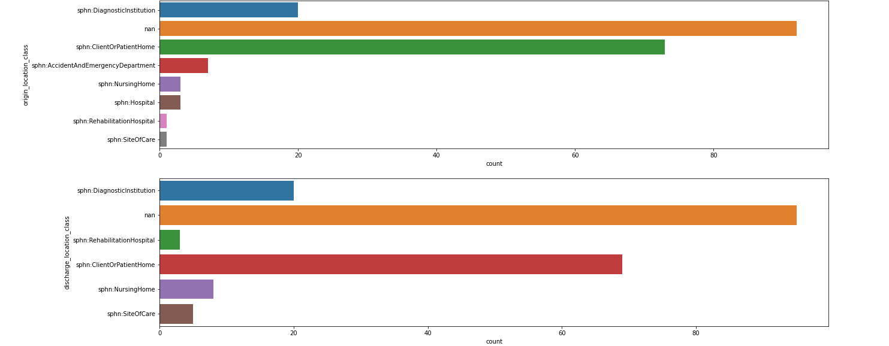
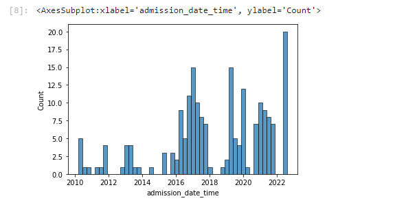
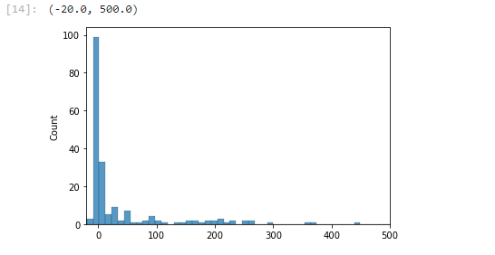
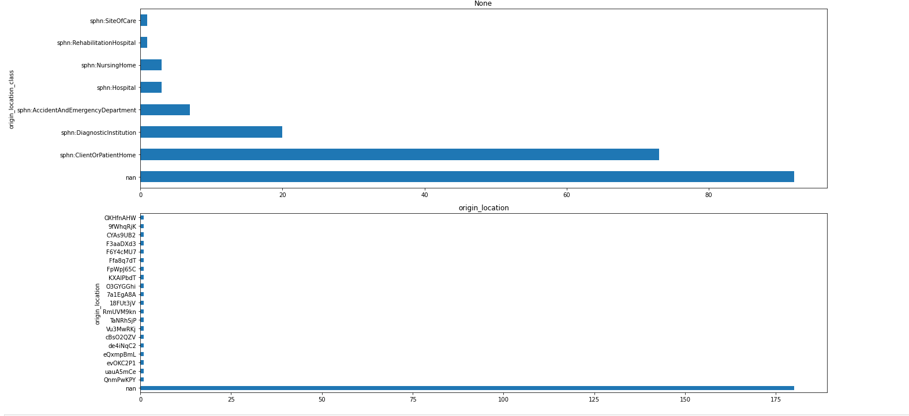

# Lib to explore SPHN datasets using a catalogue of queries

# Set up the connection

```python
from sphn import SPHNRepository

#example with a repo from GraphDB
sparql_endpoint = "http://<HOSTNAME>:7200/repositories/"

repository = "hospfair"
catalog_uri = "https://raw.githubusercontent.com/ddtxra/sphn-queries/main/"

repo = SPHNRepository(sparql_endpoint, repository, catalog_uri)
```

# Execute a query from the catalogue

```python
df = repo.execute_query("core/2022/administrative_case", 200)
```

# Explore data visually

## Using seaborn

```python
import seaborn as sns
import pandas as pd
import numpy as np

df_plot = df.replace(np.nan, 'nan')
keys = ['origin_location_class', 'origin_location']
fig, axs = plt.subplots(len(keys), figsize=(20, 10))
for i in range(len(keys)):
    sns.countplot(y=df_plot[keys[i]], ax=axs[i])
```




```python
sns.histplot(df_plot['admission_date_time'], bins=50)
```


```python
sns.histplot((df_plot['discharge_date_time'] - df_plot['admission_date_time']).dt.days)
plt.xlim([-20, 500])
```




## Using matplot lib
```python
import matplotlib.pyplot as plt
keys = ['origin_location_class', 'origin_location']
fig, axs = plt.subplots(len(keys), figsize=(20, 10))
for i in range(len(keys)):
    df.value_counts(keys[i], dropna=False).plot(kind='barh', ax=axs[i], subplots=True)
    plt.title(keys[i])
    plt.tight_layout()    
```



